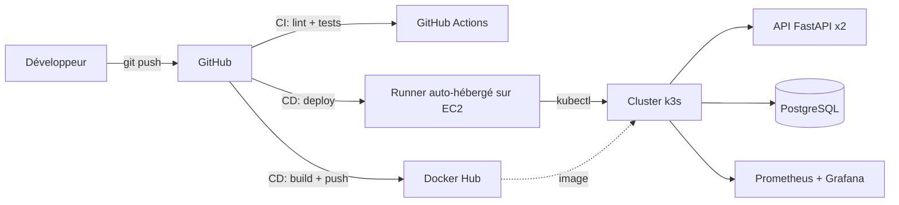

# DevOps Starter Kit

Un repo template complet pour déployer une app web (API + base de données) avec toute la chaîne DevOps automatisée : conteneurisation, CI/CD, infrastructure as code, orchestration Kubernetes, et monitoring.

Clone ce repo, adapte quelques variables, et obtiens une infrastructure de production fonctionnelle en moins d'une journée.

## Stack technique

| Brique | Outil |
|---|---|
| API | Python 3.12 + FastAPI + SQLAlchemy |
| Base de données | PostgreSQL 16 |
| Conteneurisation | Docker (multi-stage, non-root) |
| CI | GitHub Actions (lint + tests) |
| Infrastructure | Terraform (AWS EC2) |
| Configuration serveur | Ansible (k3s) |
| CD | GitHub Actions + runner auto-hébergé |
| Orchestration | Kubernetes (k3s) |
| Monitoring | Prometheus + Grafana (kube-prometheus-stack) |

## Architecture



Voir `docs/ARCHITECTURE.md` pour le détail de chaque composant.

## Démarrage rapide en local

```bash
docker compose up --build
curl http://localhost:8000/health
```

Documentation interactive : http://localhost:8000/docs

## Déploiement complet sur AWS

Voir `docs/DEPLOY.md` pour la procédure détaillée, ou en résumé :

```bash
cp infra/terraform/terraform.tfvars.example infra/terraform/terraform.tfvars
# édite terraform.tfvars avec ton IP publique (curl https://ifconfig.me)

GITHUB_RUNNER_TOKEN=xxx ./scripts/bootstrap.sh
```

## Arborescence