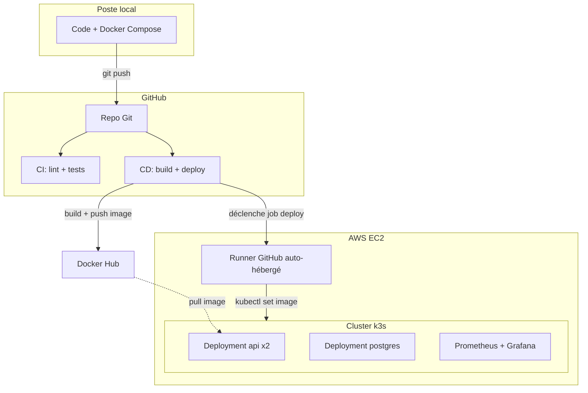

mkdir -p docs
cat > docs/ARCHITECTURE.md << 'EOF'
# Architecture

## Vue d'ensemble

## Pourquoi chaque choix technique

### Runner auto-hébergé plutôt qu'exposer l'API Kubernetes

L'approche naturelle serait de laisser GitHub Actions (hébergé, IP dynamiques) se connecter directement à l'API Kubernetes du cluster. Mais la liste des IP officielles GitHub Actions compte plusieurs milliers de plages CIDR — impraticable à gérer dans un security group AWS (limite de 60 règles).

La solution retenue : un agent GitHub Actions installé directement sur le serveur EC2, qui établit une connexion **sortante** vers GitHub (jamais bloquée par un firewall). Le job de déploiement s'exécute localement sur la machine, avec `kubectl` en local — l'API Kubernetes (port 6443) n'a besoin d'être ouverte qu'à l'IP de l'administrateur, jamais au monde extérieur.

### k3s plutôt que Kubernetes complet ou EKS

k3s est une distribution Kubernetes allégée, pensée pour tourner sur une seule machine ou des environnements aux ressources limitées — parfaite pour ce starter kit "petit budget". Une variante `pro` avec EKS managé (plus scalable, plus coûteux) pourrait être ajoutée en V2 pour des besoins de production plus importants.

### Séparation CI / CD

`ci.yml` (lint + tests, sur GitHub-hosted runner) et `cd.yml` (build + deploy, avec le job deploy sur le runner auto-hébergé) sont deux fichiers séparés. La CI valide la qualité du code sur chaque pull request, indépendamment de tout déploiement. Le CD ne se déclenche que sur `main`, et seulement après un build réussi.

### Prometheus + Grafana avec limites de ressources strictes

Sur une instance à ressources limitées, Prometheus et Grafana peuvent facilement saturer la mémoire disponible. Les limites définies dans `monitoring/helm-values/kube-prometheus-stack-values.yaml` (rétention 7 jours, limites CPU/mémoire) sont un compromis délibéré entre observabilité utile et stabilité de la machine.

## Dimensionnement de l'instance

Ce projet a été construit et testé sur une instance passée de `t3.small` (2 Go RAM) à `t3.medium` (4 Go RAM) — la première s'est révélée insuffisante une fois k3s, Postgres, l'app (2 répliques), le runner GitHub Actions et Prometheus/Grafana cumulés. Prévoir `t3.medium` au minimum pour une utilisation confortable de l'ensemble de la stack.

## Limites connues de cette V1

- **State Terraform local**, non versionné sur un backend distant (S3) — acceptable pour un usage solo, à corriger avant tout usage en équipe (voir chapitre 7 du guide DevOps associé à ce projet).
- **IP publique non fixe** : sans IP élastique, l'IP change à chaque redémarrage de l'instance, nécessitant une mise à jour manuelle de `inventory.ini` et du kubeconfig (automatisable en V2).
- **Un seul node** : pas de haute disponibilité réelle si le node tombe, malgré les 2 répliques de l'app (elles tournent toutes deux sur la même machine).
- **API exposée en HTTP**, sans certificat TLS — à ajouter (Let's Encrypt via cert-manager) avant tout usage en production réelle.
EOF