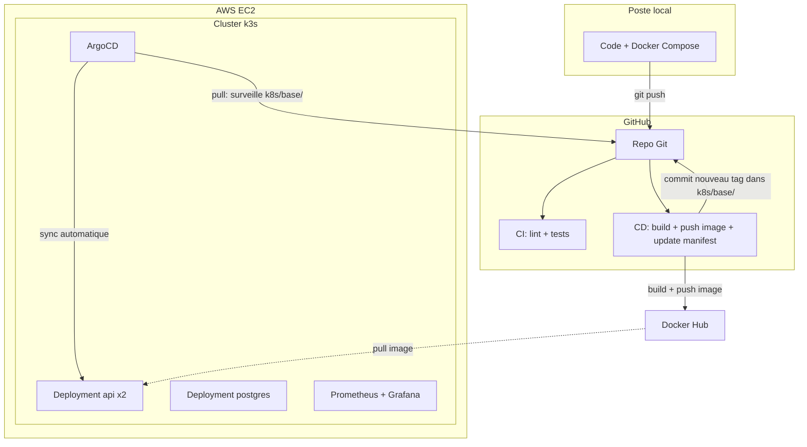

# Architecture

## Vue d'ensemble

## Pourquoi chaque choix technique

### GitOps avec ArgoCD plutôt qu'un déploiement push direct

La première version de ce projet utilisait un modèle **push** : le pipeline CD se connectait directement à l'API Kubernetes pour déployer (`kubectl set image`). Comme GitHub Actions utilise des runners aux IP dynamiques et que la liste officielle des IP GitHub compte plusieurs milliers de plages CIDR (impraticable à gérer dans un security group AWS), la solution initiale était un **runner auto-hébergé** installé directement sur le serveur EC2.

Cette approche fonctionnait, mais ajoutait de la complexité (un service supplémentaire à maintenir, à sécuriser, à mettre à jour) pour résoudre un problème que le modèle **pull** de GitOps résout plus élégamment : ArgoCD tourne **dans** le cluster et surveille en continu le dossier `k8s/base/` du repo Git. Le pipeline CD se contente de modifier le tag d'image dans un fichier YAML et de le committer — aucune connexion entrante vers le cluster n'est jamais nécessaire, ni runner, ni ouverture de port.

Bénéfice supplémentaire : le `selfHeal` d'ArgoCD corrige automatiquement toute dérive manuelle du cluster (`kubectl edit` fait par erreur, par exemple) — un filet de sécurité qu'un déploiement push classique n'offre pas.

### k3s plutôt que Kubernetes complet ou EKS

k3s est une distribution Kubernetes allégée, pensée pour tourner sur une seule machine ou des environnements aux ressources limitées — parfaite pour ce starter kit "petit budget". Une variante `pro` avec EKS managé (plus scalable, plus coûteux) pourrait être ajoutée en V2 pour des besoins de production plus importants.

### Séparation CI / CD

`ci.yml` (lint + tests, sur GitHub-hosted runner) et `cd.yml` (build + push image + mise à jour du manifest Git) sont deux fichiers séparés. La CI valide la qualité du code sur chaque pull request, indépendamment de tout déploiement. Le CD ne se déclenche que sur `main`, et seulement après un build réussi — mais il ne fait plus que préparer le changement, c'est ArgoCD qui l'applique réellement.

### Prometheus + Grafana avec limites de ressources strictes

Sur une instance à ressources limitées, Prometheus et Grafana peuvent facilement saturer la mémoire disponible. Les limites définies dans `monitoring/helm-values/kube-prometheus-stack-values.yaml` (rétention 7 jours, limites CPU/mémoire) sont un compromis délibéré entre observabilité utile et stabilité de la machine.

## Dimensionnement de l'instance

Ce projet a été construit et testé sur une instance passée de `t3.small` (2 Go RAM) à `t3.medium` (4 Go RAM) — la première s'est révélée insuffisante une fois k3s, Postgres, l'app (2 répliques), Prometheus/Grafana et ArgoCD cumulés. Prévoir `t3.medium` au minimum pour une utilisation confortable de l'ensemble de la stack.

## Limites connues de cette V1

- **State Terraform local**, non versionné sur un backend distant (S3) — acceptable pour un usage solo, à corriger avant tout usage en équipe (voir chapitre 7 du guide DevOps associé à ce projet).
- **IP publique non fixe** : sans IP élastique, l'IP change à chaque redémarrage de l'instance, nécessitant une mise à jour manuelle de `inventory.ini` et du kubeconfig (automatisable en V2).
- **Un seul node** : pas de haute disponibilité réelle si le node tombe, malgré les 2 répliques de l'app (elles tournent toutes deux sur la même machine).
- **API exposée en HTTP**, sans certificat TLS — à ajouter (Let's Encrypt via cert-manager) avant tout usage en production réelle.
- **ArgoCD accessible uniquement via port-forward** — pas encore exposé via un Ingress dédié avec authentification renforcée.
