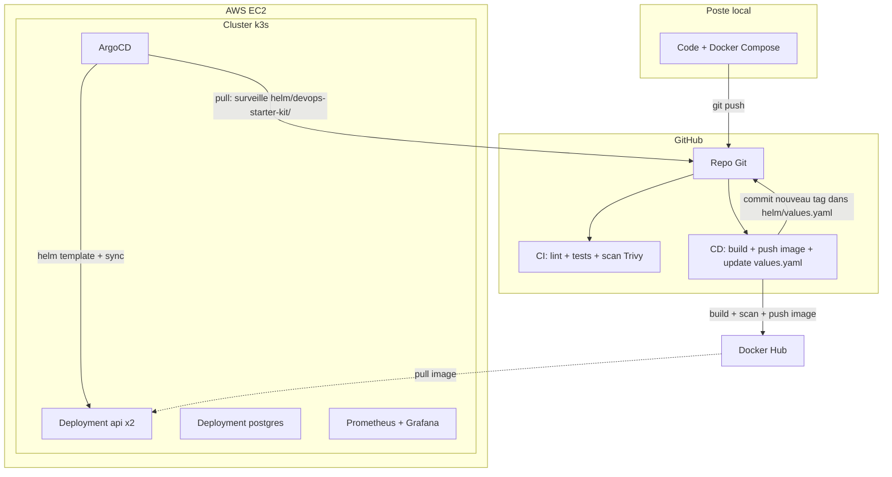

# Architecture

## Vue d'ensemble

## Pourquoi chaque choix technique

### GitOps avec ArgoCD plutôt qu'un déploiement push direct

La première version de ce projet utilisait un modèle **push** : le pipeline CD se connectait directement à l'API Kubernetes pour déployer (`kubectl set image`). Comme GitHub Actions utilise des runners aux IP dynamiques et que la liste officielle des IP GitHub compte plusieurs milliers de plages CIDR (impraticable à gérer dans un security group AWS), la solution initiale était un **runner auto-hébergé** installé directement sur le serveur EC2.

Cette approche fonctionnait, mais ajoutait de la complexité pour résoudre un problème que le modèle **pull** de GitOps résout plus élégamment : ArgoCD tourne **dans** le cluster et surveille en continu le chart Helm du repo Git. Le pipeline CD se contente de modifier le tag d'image dans `values.yaml` et de le committer — aucune connexion entrante vers le cluster n'est jamais nécessaire.

Bénéfice supplémentaire : le `selfHeal` d'ArgoCD corrige automatiquement toute dérive manuelle du cluster.

### Helm plutôt que des manifests Kubernetes bruts

Les premiers manifests (`k8s/base/`) étaient des fichiers YAML statiques — toute personnalisation (répliques, ressources, tag d'image) demandait d'éditer directement ces fichiers. Le chart Helm (`helm/devops-starter-kit/`) sépare la structure (templates) des valeurs (`values.yaml`), rendant le projet réutilisable : adapter ce starter kit à un nouveau client ne demande, en théorie, que d'éditer `values.yaml`, sans toucher aux templates.

**Point de vigilance issu de l'expérience** : lors de la migration de `k8s/base/` vers Helm, l'`Ingress` a été oublié dans le premier passage — un rappel qu'une migration doit être vérifiée exhaustivement (comparer l'ancien et le nouveau, pas seulement se fier à sa mémoire de ce qui existait).

### Trivy dans la CI

Chaque build d'image est scanné avant d'être poussé sur Docker Hub. Les vulnérabilités `CRITICAL`/`HIGH` **corrigibles** (avec un correctif amont disponible) font échouer la CI — un vrai gate de sécurité, pas un rapport informatif ignorable. Les vulnérabilités niveau OS (Debian) sans correctif disponible sont documentées et explicitement ignorées via `app/.trivyignore`, pour ne pas bloquer indéfiniment la CI sur des CVE non actionnables.

### k3s plutôt que Kubernetes complet ou EKS

k3s est une distribution Kubernetes allégée, pensée pour tourner sur une seule machine ou des environnements aux ressources limitées — parfaite pour ce starter kit "petit budget". Une variante `pro` avec EKS managé (plus scalable, plus coûteux) pourrait être ajoutée en V2.

### Séparation CI / CD

`ci.yml` (lint + tests + scan Trivy, sur GitHub-hosted runner) et `cd.yml` (build + push image + mise à jour de `values.yaml`) sont deux fichiers séparés. La CI valide la qualité et la sécurité du code sur chaque pull request. Le CD ne se déclenche que sur `main`, et seulement après un build réussi — c'est ArgoCD qui applique réellement le changement.

### Prometheus + Grafana avec limites de ressources strictes

Sur une instance à ressources limitées, Prometheus et Grafana peuvent facilement saturer la mémoire disponible. Les limites définies dans `monitoring/helm-values/kube-prometheus-stack-values.yaml` (rétention 7 jours, limites CPU/mémoire) sont un compromis délibéré entre observabilité utile et stabilité de la machine.

## Dimensionnement de l'instance

Ce projet a été construit et testé sur une instance passée de `t3.small` (2 Go RAM) à `t3.medium` (4 Go RAM) — la première s'est révélée insuffisante une fois k3s, Postgres, l'app (2 répliques), Prometheus/Grafana et ArgoCD cumulés. Prévoir `t3.medium` au minimum.

## Limites connues de cette V1

- **State Terraform local**, non versionné sur un backend distant (S3) — acceptable pour un usage solo, à corriger avant tout usage en équipe.
- **IP publique non fixe** : sans IP élastique, l'IP change à chaque redémarrage de l'instance.
- **Un seul node** : pas de haute disponibilité réelle si le node tombe.
- **API exposée en HTTP**, sans certificat TLS — à ajouter (Let's Encrypt via cert-manager) avant tout usage en production réelle.
- **ArgoCD accessible uniquement via port-forward** — pas encore exposé via un Ingress dédié avec authentification renforcée.
- **Pas de service mesh** — non nécessaire tant que le projet n'a qu'un seul microservice ; à réévaluer si l'architecture évolue vers plusieurs services communicants.
